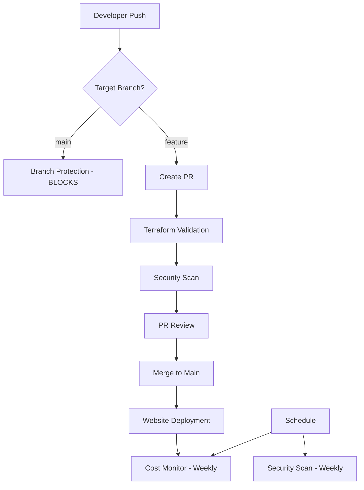

## GitHub Repository Description

**Public Website for Reflexologist – Built with AWS Serverless Services**

This repository contains the code and resources for a modern, responsive website for a professional reflexologist. The site is designed to present services, information about reflexology, and contact details in a clean and accessible way.

### How This Repository Works

This repository provides a complete Infrastructure-as-Code solution with automated deployment and cost monitoring:

- **Terraform Configuration**: Automatically provisions AWS resources (S3, CloudFront, ACM certificates)
- **GitHub Actions**: Deploys website files to S3 bucket on every push to main branch
- **Pre-commit Hooks**: Monitors AWS usage to ensure you stay within Free Tier limits
- **Cost Protection**: Automated checks prevent unexpected charges by validating resource usage

### Repository Structure

```
├── bucket-contents/     # Website files (HTML, CSS, images)
├── terraform/          # Infrastructure-as-Code configuration
├── .github/workflows/  # GitHub Actions for automated deployment
├── .pre-commit-config.yaml # Cost monitoring and validation hooks
└── README.md          # This documentation
```

### Features

- **Static, single-page website** (HTML/CSS, no backend required)
- **Responsive design** for mobile and desktop
- **Contact form** (integrated with Formspree for email delivery)
- **Informative sections**:
  - About the therapist
  - What is reflexology
  - Benefits and applications
  - Contact information

### Prerequisites

- **AWS Account** with Free Tier eligibility
- **GitHub Account** for repository hosting and CI/CD
- **Terraform** >= 1.0 installed locally
- **AWS CLI** configured with appropriate credentials
- **Git** installed for version control
- **Domain name** (optional, for custom domain setup)

### AWS Architecture

- **Amazon S3**: Static website hosting
- **Amazon CloudFront**: CDN and HTTPS support
- **AWS Certificate Manager (ACM)**: Free SSL certificates
- **Route 53**: Custom domain management (optional)

## GitHub Actions Workflows

This repository includes five automated workflows that provide comprehensive CI/CD, security, and monitoring capabilities:

### 1. **Branch Protection** (`protect-main.yml`)
**Trigger**: Push to main branch  
**Purpose**: Prevents direct pushes to main branch, enforcing PR workflow

**What it does:**
- Blocks any direct push to main branch
- Provides clear instructions on how to create a PR instead
- Ensures all changes go through code review process

**Key Features:**
- Immediate failure with helpful error messages
- Commands to fix accidental direct pushes
- Enforces best practices for collaborative development

### 2. **Terraform Validation** (`terraform-validate.yml`)
**Trigger**: Pull requests and pushes affecting `terraform/` directory  
**Purpose**: Validates Terraform code quality and syntax

**What it does:**
- **Format Check**: Ensures consistent Terraform formatting
- **Initialization**: Sets up Terraform with required providers
- **Validation**: Checks syntax and configuration validity
- **Plan Generation**: Shows what changes will be made (on PRs)

**Key Features:**
- Runs only when Terraform files change (efficient)
- Uses proper AWS authentication with OIDC
- Provides plan output for review before merging
- Prevents broken infrastructure code from reaching main

### 3. **Website Deployment** (`deploy.yml`)
**Trigger**: Push to main branch or manual dispatch  
**Purpose**: Deploys website files to S3 and invalidates CloudFront cache

**What it does:**
- **Pre-deployment Validation**: Checks secrets, variables, and file structure
- **S3 Bucket Verification**: Ensures bucket exists and is accessible
- **File Synchronization**: Uploads website files with validation
- **CloudFront Invalidation**: Clears CDN cache for immediate updates
- **Deployment Verification**: Confirms successful deployment

**Key Features:**
- **Environment Support**: Manual deployment to staging/production
- **Error Handling**: Comprehensive validation at each step
- **File Count Verification**: Ensures all files were uploaded
- **Graceful Degradation**: Continues if CloudFront isn't configured
- **Detailed Logging**: Clear success/failure indicators

### 4. **Cost Monitoring** (`cost-monitor.yml`)
**Trigger**: Weekly schedule (Mondays 9 AM) or manual dispatch  
**Purpose**: Monitors AWS costs to prevent unexpected charges

**What it does:**
- **Cost Retrieval**: Gets current month AWS spending
- **Threshold Checking**: Alerts if costs exceed $5
- **Free Tier Protection**: Ensures you stay within AWS Free Tier limits

**Key Features:**
- **Automated Scheduling**: Weekly cost checks
- **Threshold Alerts**: Warnings when approaching limits
- **Manual Trigger**: On-demand cost checking
- **GitHub Warnings**: Visible alerts in Actions tab

### 5. **Security Scanning** (`security-scan.yml`)
**Trigger**: Push/PR to main, weekly schedule, or manual dispatch  
**Purpose**: Scans for vulnerabilities and secrets in the codebase

**What it does:**
- **Vulnerability Scanning**: Uses Trivy to scan for security issues
- **Secret Detection**: Uses TruffleHog to find exposed credentials
- **SARIF Upload**: Integrates with GitHub Security tab
- **Continuous Monitoring**: Regular security health checks

**Key Features:**
- **Multiple Scan Types**: File system and secret scanning
- **GitHub Integration**: Results appear in Security tab
- **Scheduled Scans**: Weekly automated security checks
- **SARIF Format**: Industry-standard security reporting

## Workflow Dependencies and Interactions



## Required GitHub Configuration

### Repository Secrets
- `AWS_ROLE_ARN`: IAM role ARN for GitHub OIDC authentication

### Repository Variables  
- `BUCKET_NAME`: S3 bucket name for website hosting
- `AWS_REGION`: AWS region (defaults to us-east-1)

### GitHub Environments (Optional)
- `production`: For production deployments
- `staging`: For staging deployments (if using multi-environment setup)

### How to Use

#### Option 1: Automated Deployment with Terraform (preffered)

1. **Clone the repository** and edit website files in `bucket-contents/` with your details.
2. **Configure Terraform**:
   - Navigate to the `terraform/` directory
   - Update `terraform/tfvars/main.tfvars` with your values
   - The tfvars directory structure supports multiple environments (e.g., `dev.tfvars`, `staging.tfvars`, `prod.tfvars`)
   - Run `terraform init` to initialize
   - Run `terraform plan -var-file="tfvars/main.tfvars"` to review changes
   - Run `terraform apply -var-file="tfvars/main.tfvars"` to deploy infrastructure
3. **Upload website files**: The Terraform configuration will create the S3 bucket and upload your website files automatically.
4. **Set up GitHub secrets and variables**:
   - Go to your GitHub repository → Settings → Secrets and variables → Actions
   - Add **Repository secrets**:
     - `AWS_ROLE_ARN`: The IAM role ARN created by Terraform (from outputs)
   - Add **Repository variables**:
     - `BUCKET_NAME`: Your S3 bucket name (same as in tfvars)
     - `AWS_REGION`: Your AWS region (same as in tfvars, defaults to us-east-1)
5. **Go live!** Your site is now publicly accessible.

#### Option 2: Manual Setup

1. **Clone the repository** and edit `index.html` with your own contact details.
2. **Upload the files** (`index.html`, `style.css`, images) to your S3 bucket.
3. **Configure S3** for static website hosting and set permissions for public read access.
4. (Optional) **Set up CloudFront and ACM** for HTTPS and custom domain support.
5. **Go live!** Your site is now publicly accessible.

### Zero-Cost Hosting Guide 

You can host this website completely free within AWS Free Tier:

1. **Create an AWS account** if you don't have one (eligible for Free Tier).
2. **Create an S3 bucket**:
   - Name it something unique (e.g., `reflexology-website-yourusername`)
   - Select the region closest to your target audience
   - Keep all default settings
3. **Enable static website hosting**:
   - Go to bucket Properties → Static website hosting → Enable
   - Set index document to `index.html`
   - Note the bucket website endpoint URL
4. **Set bucket permissions**:
   - Create a bucket policy to allow public read access:
   ```json
   {
     "Version": "2012-10-17",
     "Statement": [
       {
         "Sid": "PublicReadGetObject",
         "Effect": "Allow",
         "Principal": "*",
         "Action": "s3:GetObject",
         "Resource": "arn:aws:s3:::YOUR-BUCKET-NAME/*"
       }
     ]
   }
   ```
   - Replace `YOUR-BUCKET-NAME` with your actual bucket name
5. **Upload your website files**:
   - Upload all HTML, CSS, images, and other assets
   - Set appropriate content types (e.g., text/html for HTML files)
6. **Stay within Free Tier limits**:
   - S3 Free Tier includes 5GB storage, 20,000 GET requests, and 2,000 PUT requests per month
   - Keep image sizes optimized to reduce storage needs
   - For a simple reflexology website, this is typically more than sufficient

This approach uses only S3 static website hosting, which is included in the AWS Free Tier. By avoiding CloudFront, Route 53, and other services, you can maintain zero cost as long as you stay within Free Tier limits.

### Custom Domain Setup with CloudFront

If you own a custom domain and want to use it with your reflexology website, follow these steps:

1. **Request an SSL Certificate**:
   - Go to AWS Certificate Manager (ACM) in the US East (N. Virginia) region
   - Request a public certificate for your domain (e.g., `yourdomain.com` and `www.yourdomain.com`)
   - Validate the certificate by adding the provided CNAME records to your domain's DNS settings
   - Wait for the certificate to be issued (status: "Issued")

2. **Create a CloudFront Distribution**:
   - Go to CloudFront and create a new distribution
   - For Origin Domain, select your S3 bucket website endpoint
   - Set Origin Path to empty
   - For Origin Access, select "Public"
   - For Viewer Protocol Policy, select "Redirect HTTP to HTTPS"
   - For Allowed HTTP Methods, select "GET, HEAD"
   - For Cache Policy, select "CachingOptimized"
   - For Price Class, choose based on your audience location (Price Class 100 is cheapest)
   - For Alternate Domain Names (CNAMEs), enter your domain (e.g., `yourdomain.com` and `www.yourdomain.com`)
   - For Custom SSL Certificate, select the certificate you created in ACM
   - For Default Root Object, enter `index.html`
   - Create the distribution and wait for it to deploy (Status: "Deployed")

3. **Configure DNS Settings**:
   - If using Route 53:
     - Create a hosted zone for your domain
     - Create an A record with Alias pointing to your CloudFront distribution
   - If using another DNS provider:
     - Create a CNAME record pointing to your CloudFront distribution domain name

4. **Cost Considerations**:
   - CloudFront: First 1TB of data transfer out per month is free in the AWS Free Tier
   - Route 53: Approximately $0.50 per hosted zone per month (not included in Free Tier)
   - Domain registration: Varies based on registrar and TLD (typically $10-15/year)
   - ACM: SSL certificates are free when used with CloudFront

5. **Verify Setup**:
   - Wait for DNS changes to propagate (can take up to 48 hours)
   - Visit your domain (https://yourdomain.com) to confirm it's working correctly
   - Test on different devices to ensure responsive design works properly

This setup provides several advantages over the basic S3 hosting:
- HTTPS security with a free SSL certificate
- Better performance through CloudFront's global CDN
- Professional appearance with your custom domain
- Improved SEO ranking (search engines prefer HTTPS sites)

## Troubleshooting

### Common Issues

**Terraform apply fails**
- Check AWS credentials: `aws sts get-caller-identity`
- Verify IAM permissions for S3, CloudFront, and ACM
- Ensure bucket name is globally unique

**GitHub Actions deployment fails**
- Verify `AWS_ROLE_ARN` secret is set correctly
- Check `BUCKET_NAME` and `AWS_REGION` variables
- Confirm IAM role has trust relationship with GitHub OIDC

**Website not loading**
- Check CloudFront distribution status (should be "Deployed")
- Verify S3 bucket has website files
- Wait for DNS propagation (up to 48 hours for custom domains)

**SSL certificate issues**
- Ensure certificate is requested in `us-east-1` region (required for CloudFront)
- Verify domain validation is complete
- Check certificate status is "Issued"

**Terraform circular dependency error**
- This should be resolved with the current configuration
- If issues persist, run `terraform destroy` and `terraform apply` again

### Getting Help

- Check AWS CloudFormation events for detailed error messages
- Review GitHub Actions logs for deployment issues
- Verify all prerequisites are installed and configured

### Demo

A live demo is available at:
`http://your-s3-bucket-endpoint`
(or your custom domain, if configured)

Feel free to fork, modify, and use this template for your own professional website!
